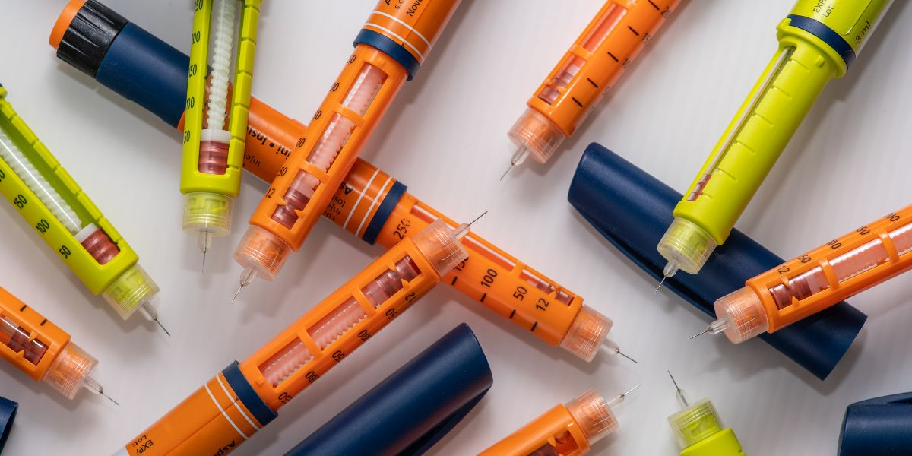
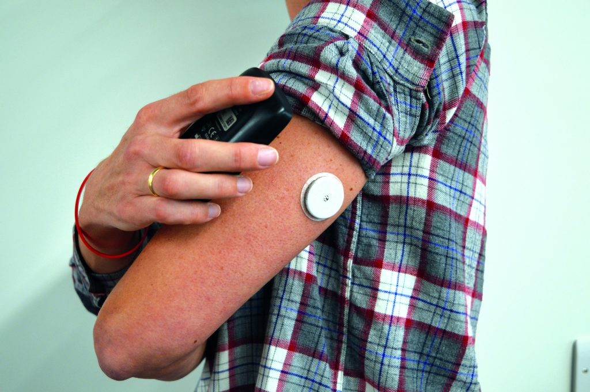

# 💉 Сахарный диабет I типа

## Актуальность темы 

Почему я решил поднять тему? Да потому что людей, больных диабетом в мире насчитывается около **422млн.** по данным ВОЗ в 2014 году, и до сих пор не разработаны меры профилактики диабета I типа.

## Как заболевают диабетом I типа? 

\- часто диабет I типа называют "**детским диабетом**", так как он появляется обычно в возрасте 10-13 лет (во время сильных изменений в организме, в этом возрасте происходит подростковый период), примерно до 30 лет. \
\* Причины так же может быть **наследственные**, например, если отец ребёнка болеет диабетом I типа, то у ребёнка риск его развития повышается. \
\* Так же играют свою роль **внешние факторы** и **диабетогенные химические вещества**, такие как **Стрептозоцин**


#### Интересные факты: 

1. **Стрептозоцин** ранее применялся в качестве антибиотиков, на данный момент его используют ради повреждения клеток поджелудочной железы в экспериментах на животных (я жив, не переживайте)
2. Диабетом I типа не заболевают из-за большого количества сладкого (да, в детстве диабетом вас лишь пугали)


## Лечение 

### Инсулинотерапия 

Задачей инсулинотерпии является максимальная компенсация нарушений углеводного обмена, предотвращение гипергликемии (повышенным сахаром в крови) и профилактика осложнений сахарного диабета I типа. Инсулинотерапия может применяться так же и при лечении сахарного диабета II типа.

Инсулин вводится инсулиновым шприцом, шприц-ручкой (фотографию можете посмотреть ниже) или инсулиновой помпой.

<figure><figcaption>
Шприц-ручки
</figcaption></figure>

### Мониторинг 

При мониторинге уровня сахара в крови может использоваться обычный глюкометр, либо специальные устройства, постоянно контролирующие сахар в крови, например, FreeStyle Libre 2. FreeStyle Libre 2 умеет передавать информацию об уровне глюкозы в крови прямо на телефон, и сообщит, если уровень глюкозы выше, или ниже нормы.

<figure><figcaption>
FreeStyle Libre 2
</figcaption></figure>

### Диета 

При диабете соблюдается диета, которая преследует цели поддержания нормальной массы тела, нормального уровня холестерина и уровня глюкозы. При этом, если вам казалось, что **при диабете нельзя сладкое, то я вас удивлю, его как раз можно**, и иногда **даже нужно**. Сладкое при контроле диабета используется для быстрого поднятия уровня сахара в крови при гипогликемии (маленьком уровне сахара в крови). Диабетики I типа всегда носят с собой что-нибудь такое, что может быстро поднять уровень сахара в крови, например шоколадку.

### Экспериментальные способы лечения 

В первой фазе клинических испытаний **ДНК-вакцины BHT-3021** приняли участие 80 пациентов старше 18 лет, у которых диагноз "диабет I типа" был поставлен в последние 5 лет. Половина из них еженедельно в течение 12 недель получали внутримышечные инъекции BHT-3021, а вторая половина - плацебо. По истечении этого срока группа, получавшая вакцину, продемонстрировала повышение уровня С-пептидов в крови - биомаркера, свидетельствующего о восстановлении функции бета-клеток.

## Поддержка государства и группы инвалидности 

Многие страны своим гражданам выделяют бесплатные средства для контроля и мониторинга диабета, например в Российской Федерации до 18 лет вам будут выдавать FreeStyle Libre 2, и инсулин, прописанный врачом. При этом, инсулин можно будет получить и после 18 лет бесплатно. FreeStyle Libre 2 можно так же получить в Российской Федерации после 18 лет, но требуются дополнительные заявки, которые не будут рассмотрены в этом посте. В той же Российской Федерации вам назначат инвалидность III группы.


С сахарным диабетом I типа невозможно попасть в армию в связи с недостаточным контролем заболевания при службе.


## Прогноз 

С диабетом I типа можно прожить вполне полноценную и хорошую жизнь, если вы увидите человека с диабетом I типа, не считайте, что он какой то инвалид, он такой же человек как и вы, просто с особенностью. От человека практически не зависит то, заболеет от диабетом I типа или нет.

## Источники 

1. [ВОЗ](https://www.who.int/news-room/fact-sheets/detail/diabetes)
2. [Испытания ДНК-вакцины BHT-3021 (English)](https://www.science.org/doi/abs/10.1126/scitranslmed.3006103?sid=e4eeba36-f367-488b-a324-fe80ac5df2fc)
3. [Испытания ДНК-вакцины BHT-3021 (Русский)](https://medportal.ru/mednovosti/dnk-vaktsinu-ot-diabeta-1-tipa-uspeshno-ispytali-na-lyudyah)
4. [Питание при сахарном диабете](https://mgbsmp.by/informatsiya/shkola-sakharnogo-diabeta/558-tema-3-pitanie-pri-sakharnom-diabete-obshchie-printsipy)
5. [Определение и диагностика сахарного диабета и средней гипергликемии, отчёт консультации ВОЗ](https://web.archive.org/web/20120511072821/http://www.who.int/diabetes/publications/Definition%20and%20diagnosis%20of%20diabetes\_new.pdf)
